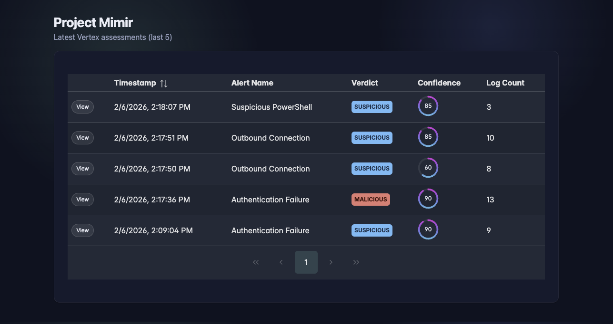
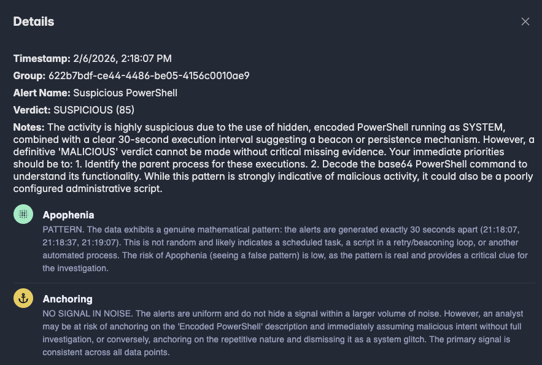

<br />
<div align="center">
  <a href="https://github.com/skothasec/project-mimir">
    
  </a>

<h3 align="center">Project Mimir</h3>

  <p align="center">
    An AI-powered Cognitive Bias Risk & Reasoning Assessment Engine for Security Operations.
    <br />
    <a href="https://github.com/skothasec/project-mimir"><strong>Explore the docs »</strong></a>
    <br />
    <br />
    <a href="https://github.com/skothasec/project-mimir/issues">Report Bug</a>
    &middot;
    <a href="https://github.com/skothasec/project-mimir/issues">Request Feature</a>
  </p>
</div>

<details>
  <summary>Table of Contents</summary>
  <ol>
    <li>
      <a href="#about-the-project">About The Project</a>
      <ul>
        <li><a href="#built-with">Built With</a></li>
      </ul>
    </li>
    <li>
      <a href="#getting-started">Getting Started</a>
      <ul>
        <li><a href="#prerequisites">Prerequisites</a></li>
        <li><a href="#installation">Installation</a></li>
      </ul>
    </li>
    <li><a href="#usage">Usage</a></li>
    <li><a href="#roadmap">Roadmap</a></li>
    <li><a href="#license">License</a></li>
    <li><a href="#contact">Contact</a></li>
  </ol>
</details>

## About The Project

**Project Mimir** is a security reasoning engine designed to **pre-emptively identify Cognitive Risks** within security alerts.

Rather than monitoring the analyst, Mimir analyzes the *alert data itself* before it reaches the human. It identifies data structures that are likely to trigger cognitive biases and determines which reasoning model (Deductive, Abductive, or Inductive) is required to solve the investigation.

In a modern SOC, the structure of alert data often leads to some cognitive traps such as:
1.  **Anchoring Risk:** High volumes of "noise" (e.g., repeated low-severity logs) that predispose analysts to miss a critical "signal" hidden at the end.
2.  **Apophenia Risk:** Random data clusters that mimic patterns (e.g., random high-port connections), tempting analysts to find false correlations.
3.  **Abductive Reasoning Gaps:** Alerts with missing evidence (like a null Parent Process) that require the analyst to *infer* the cause rather than *deduce* it.

Mimir uses **Google Vertex AI (Gemini Pro)** to analyze incoming alerts for these risks and appending a "Cognitive Verdict" to the investigation record to guide the analyst's approach.

### Project Screenshots
<p align="center">

</p>

<p align="center">

</p>

### Built With

* 
* 
* 
* 

## Getting Started

Follow these steps to deploy the infrastructure and reasoning engine to your Google Cloud environment.

### Prerequisites

* Google Cloud SDK (`gcloud`) installed and authenticated.
* Terraform installed.
* Docker installed.
* Python 3.11+.

### Installation & Deployment

1.  **Clone the repository**
    ```sh
    git clone https://github.com/skothasec/project-mimir.git
    cd project-mimir
    ```

2.  **Set your GCP Project ID**
    ```sh
    export PROJECT_ID="your-gcp-project-id"
    ```

3.  **Deploy Infrastructure & App**
    This script handles Terraform init/apply, Docker build/push, and Cloud Run deployment.
    ```sh
    ./deploy.sh
    ```

## Usage

Mimir includes a **Bias Generator** to simulate specific alert scenarios. This is used to test the AI's ability to identify potential biases and reasoning gaps that an analyst may face when viewing the data.

### 1. Run a Test Scenario
Use the helper script to generate synthetic alerts and send them to the pipeline.

```sh
# Syntax: ./scripts/run_test.sh [BIAS_TYPE] [VARIANT]

# Test Anchoring Bias (High noise, hidden signal)
./scripts/run_test.sh anchoring trap

./scripts/run_test.sh anchoring truth

# Test Apophenia (Random noise looking like a pattern)
./scripts/run_test.sh apophenia trap

./scripts/run_test.sh apophenia truth

# Test Abduction (missing data creating need to rely on abductive reasoning)
./scripts/run_test.sh abduction trap

./scripts/run_test.sh abduction truth
```

### 2. View Results in BigQuery
Go to the GCP Console -> BigQuery and run:

```sql
SELECT 
  timestamp,
  JSON_VALUE(bias_analysis, '$.final_verdict') as verdict,
  JSON_VALUE(bias_analysis, '$.verdict_confidence') as verdict_confidence,
  JSON_VALUE(bias_analysis, '$.Notes for Analyst') as notes,
  JSON_VALUE(bias_analysis, '$.apophenia_risk') as apophenia,
  JSON_VALUE(bias_analysis, '$.anchoring_analysis') as anchoring,
  JSON_VALUE(bias_analysis, '$.abductive_notes') as abduction,
  bias_analysis
  raw_log_summary as raw_logs,
  alert_group_id,
FROM `mimir_security_lake.investigations_results`
ORDER BY timestamp DESC
LIMIT 5
```

## License
Distributed under the MIT License. See LICENSE for more information.

## Contact
Christian Gorke - @skothasec

Project Link: https://github.com/skothasec/project-mimir